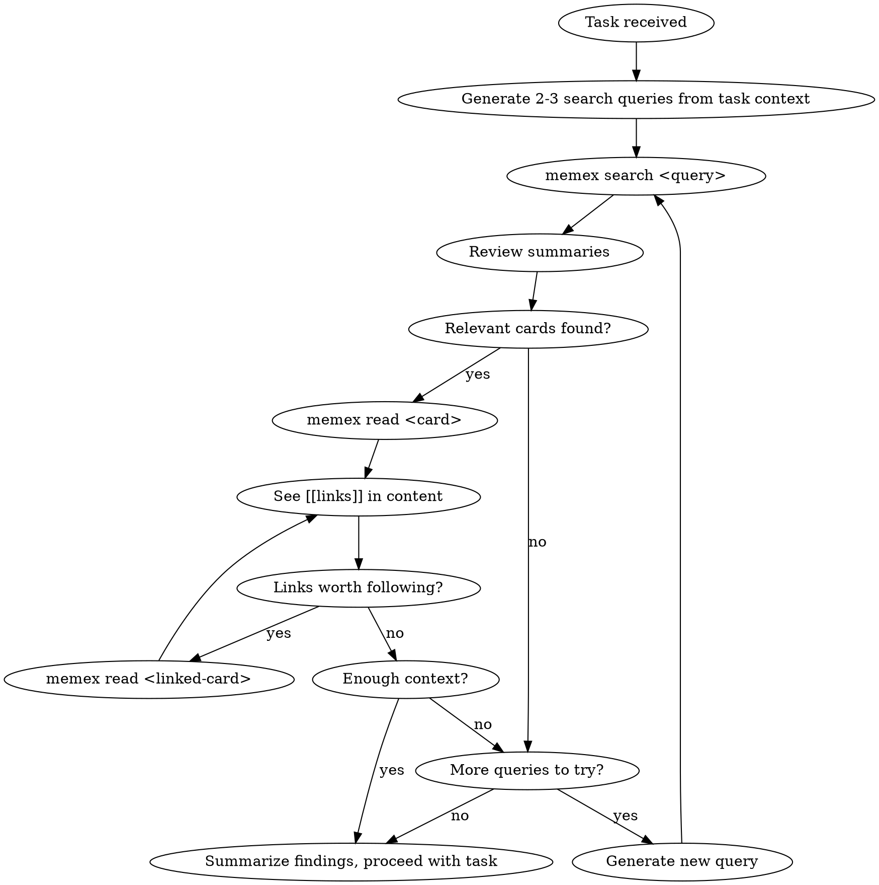
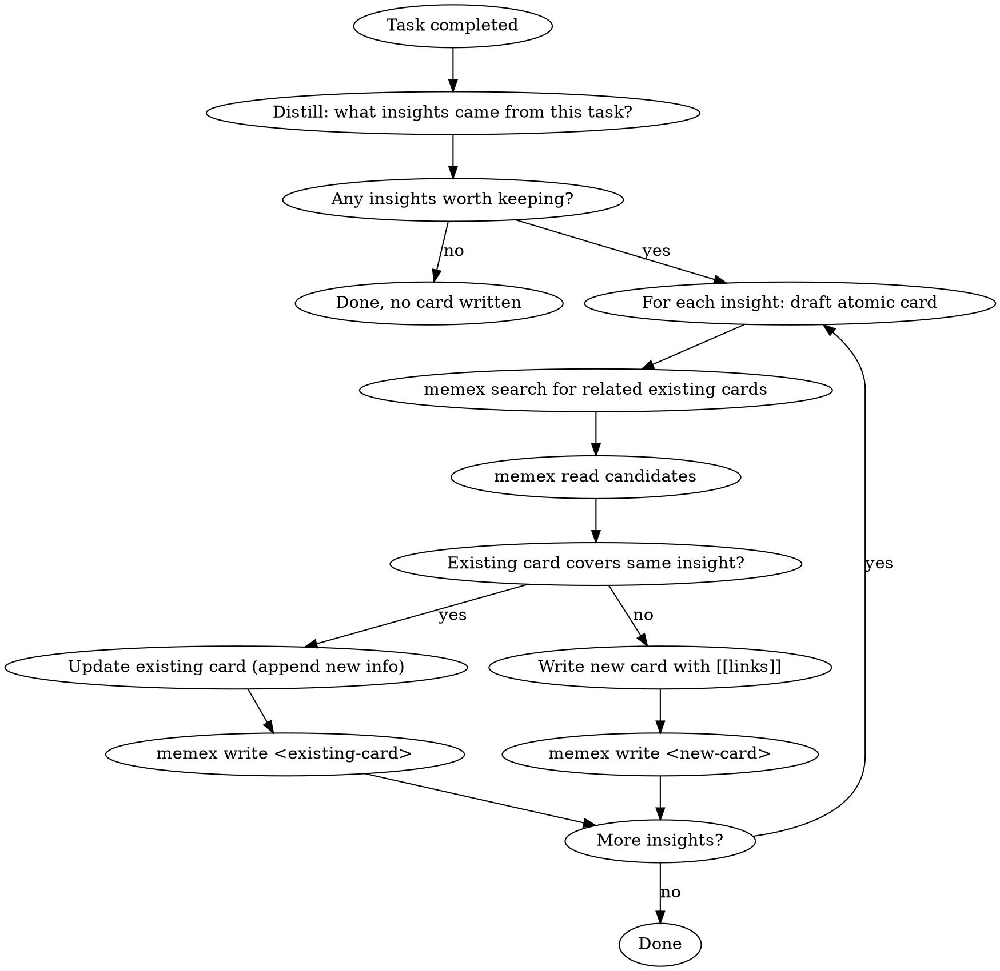
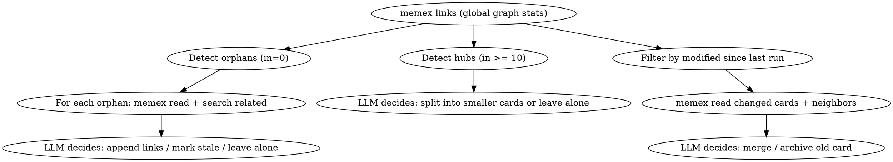

# memex-cli Implementation Plan

> **For agentic workers:** REQUIRED: Use superpowers:subagent-driven-development (if subagents available) or superpowers:executing-plans to implement this plan. Steps use checkbox (`- [ ]`) syntax for tracking.

**Goal:** Build a Zettelkasten-based agent memory CLI with 5 commands (search/read/write/links/archive) and 3 skills (recall/retro/organize).

**Architecture:** CLI is a pure data layer (Node/TS) with no LLM dependency. Skills contain all LLM intelligence and call CLI commands. Storage is flat markdown files in `~/.memex/cards/` with `[[wikilink]]` bidirectional links.

**Tech Stack:** TypeScript, commander, gray-matter, @vscode/ripgrep, vitest

**Spec:** `docs/superpowers/specs/2026-03-18-memex-cli-design.md`

---

## File Structure

```
memex-cli/
  src/
    cli.ts                    # CLI entry point, commander setup
    commands/
      search.ts               # Full-text search via ripgrep
      read.ts                 # Read card content
      write.ts                # Write card with frontmatter validation
      links.ts                # Link graph analysis
      archive.ts              # Move card to archive
    lib/
      parser.ts               # Parse frontmatter + extract [[links]]
      store.ts                # File system ops (scan, resolve, read, write, move)
      formatter.ts            # Output formatting for search/links results
  skills/
    memex-recall/
      index.md                # Recall skill prompt
    memex-retro/
      index.md                # Retro skill prompt
    memex-organize/
      index.md                # Organize skill prompt
  tests/
    lib/
      parser.test.ts
      store.test.ts
      formatter.test.ts
    commands/
      search.test.ts
      read.test.ts
      write.test.ts
      links.test.ts
      archive.test.ts
    integration/
      cli.test.ts             # End-to-end CLI tests
  package.json
  tsconfig.json
  vitest.config.ts
```

---

## Chunk 1: Foundation + Core Library

### Task 1: Project Setup

**Files:**
- Create: `package.json`
- Create: `tsconfig.json`
- Create: `vitest.config.ts`
- Create: `src/cli.ts` (stub)

- [ ] **Step 1: Initialize npm project**

```bash
cd /Users/touchskyer/Code/memex-cli
npm init -y
```

- [ ] **Step 2: Install dependencies**

```bash
npm install commander gray-matter @vscode/ripgrep
npm install -D typescript vitest @types/node
```

- [ ] **Step 3: Create tsconfig.json**

```json
{
  "compilerOptions": {
    "target": "ES2022",
    "module": "Node16",
    "moduleResolution": "Node16",
    "outDir": "dist",
    "rootDir": "src",
    "strict": true,
    "esModuleInterop": true,
    "declaration": true,
    "sourceMap": true
  },
  "include": ["src/**/*"]
}
```

- [ ] **Step 4: Create vitest.config.ts**

```typescript
import { defineConfig } from "vitest/config";

export default defineConfig({
  test: {
    globals: true,
  },
});
```

- [ ] **Step 5: Add scripts to package.json**

Add to `package.json`:
```json
{
  "type": "module",
  "bin": {
    "memex": "dist/cli.js"
  },
  "scripts": {
    "build": "tsc",
    "test": "vitest run",
    "test:watch": "vitest"
  }
}
```

- [ ] **Step 6: Create CLI stub**

Create `src/cli.ts`:
```typescript
#!/usr/bin/env node
import { Command } from "commander";

const program = new Command();
program.name("memex").description("Zettelkasten agent memory CLI").version("0.1.0");
program.parse();
```

- [ ] **Step 7: Create .gitignore**

Create `.gitignore`:
```
node_modules/
dist/
```

- [ ] **Step 8: Verify build works**

```bash
npx tsc
node dist/cli.js --help
```
Expected: Shows help with "memex" name and description.

- [ ] **Step 9: Commit**

```bash
git add .gitignore package.json package-lock.json tsconfig.json vitest.config.ts src/cli.ts
git commit -m "feat: project setup with commander, gray-matter, vitest"
```

---

### Task 2: Parser Library

**Files:**
- Create: `src/lib/parser.ts`
- Create: `tests/lib/parser.test.ts`

This module parses card frontmatter and extracts `[[wikilinks]]` from markdown content.

- [ ] **Step 1: Write failing tests for parseFrontmatter**

Create `tests/lib/parser.test.ts`:
```typescript
import { describe, it, expect } from "vitest";
import { parseFrontmatter, extractLinks } from "../../src/lib/parser.js";

describe("parseFrontmatter", () => {
  it("parses valid frontmatter with all fields", () => {
    const content = `---
title: Test Card
created: 2026-03-18
modified: 2026-03-18
source: retro
---

Body content here.`;

    const result = parseFrontmatter(content);
    expect(result.data.title).toBe("Test Card");
    expect(result.data.source).toBe("retro");
    expect(result.content).toContain("Body content here.");
  });

  it("returns empty data for content without frontmatter", () => {
    const result = parseFrontmatter("Just plain text.");
    expect(result.data).toEqual({});
    expect(result.content).toBe("Just plain text.");
  });
});

describe("extractLinks", () => {
  it("extracts wikilinks from content", () => {
    const content = "See [[stateless-auth]] and also [[redis-session-store]] for details.";
    const links = extractLinks(content);
    expect(links).toEqual(["stateless-auth", "redis-session-store"]);
  });

  it("returns empty array when no links", () => {
    const links = extractLinks("No links here.");
    expect(links).toEqual([]);
  });

  it("deduplicates links", () => {
    const content = "See [[foo]] and then [[foo]] again.";
    const links = extractLinks(content);
    expect(links).toEqual(["foo"]);
  });

  it("extracts links only from body, not frontmatter", () => {
    const content = `---
title: "About [[not-a-link]]"
---

Real link to [[actual-link]].`;

    const { content: body } = parseFrontmatter(content);
    const links = extractLinks(body);
    expect(links).toEqual(["actual-link"]);
  });
});
```

- [ ] **Step 2: Run tests to verify they fail**

```bash
npx vitest run tests/lib/parser.test.ts
```
Expected: FAIL — module not found.

- [ ] **Step 3: Implement parser**

Create `src/lib/parser.ts`:
```typescript
import matter from "gray-matter";

export interface ParsedCard {
  data: Record<string, unknown>;
  content: string;
}

export function parseFrontmatter(raw: string): ParsedCard {
  const { data, content } = matter(raw);
  return { data, content };
}

export function extractLinks(body: string): string[] {
  const re = /\[\[([^\]]+)\]\]/g;
  const links = new Set<string>();
  let match: RegExpExecArray | null;
  while ((match = re.exec(body)) !== null) {
    links.add(match[1]);
  }
  return [...links];
}
```

- [ ] **Step 4: Run tests to verify they pass**

```bash
npx vitest run tests/lib/parser.test.ts
```
Expected: All 4 tests PASS.

- [ ] **Step 5: Commit**

```bash
git add src/lib/parser.ts tests/lib/parser.test.ts
git commit -m "feat: parser library for frontmatter and [[wikilink]] extraction"
```

---

### Task 3: Store Library

**Files:**
- Create: `src/lib/store.ts`
- Create: `tests/lib/store.test.ts`

This module handles file system operations: scanning cards, resolving slugs to paths, reading/writing files, moving to archive.

- [ ] **Step 1: Write failing tests**

Create `tests/lib/store.test.ts`:
```typescript
import { describe, it, expect, beforeEach, afterEach } from "vitest";
import { mkdtemp, rm, mkdir, writeFile, readFile } from "node:fs/promises";
import { tmpdir } from "node:os";
import { join } from "node:path";
import { CardStore } from "../../src/lib/store.js";

describe("CardStore", () => {
  let tmpDir: string;
  let cardsDir: string;
  let archiveDir: string;
  let store: CardStore;

  beforeEach(async () => {
    tmpDir = await mkdtemp(join(tmpdir(), "memex-test-"));
    cardsDir = join(tmpDir, "cards");
    archiveDir = join(tmpDir, "archive");
    await mkdir(cardsDir, { recursive: true });
    await mkdir(archiveDir, { recursive: true });
    store = new CardStore(cardsDir, archiveDir);
  });

  afterEach(async () => {
    await rm(tmpDir, { recursive: true, force: true });
  });

  describe("scanAll", () => {
    it("returns all .md files recursively", async () => {
      await writeFile(join(cardsDir, "a.md"), "---\ntitle: A\n---\n");
      await mkdir(join(cardsDir, "sub"), { recursive: true });
      await writeFile(join(cardsDir, "sub", "b.md"), "---\ntitle: B\n---\n");

      const files = await store.scanAll();
      const slugs = files.map((f) => f.slug).sort();
      expect(slugs).toEqual(["a", "b"]);
    });

    it("returns empty array when no cards", async () => {
      const files = await store.scanAll();
      expect(files).toEqual([]);
    });
  });

  describe("resolve", () => {
    it("finds card by slug in flat directory", async () => {
      await writeFile(join(cardsDir, "test-card.md"), "content");
      const path = await store.resolve("test-card");
      expect(path).toBe(join(cardsDir, "test-card.md"));
    });

    it("finds card by slug in subdirectory", async () => {
      await mkdir(join(cardsDir, "sub"), { recursive: true });
      await writeFile(join(cardsDir, "sub", "nested.md"), "content");
      const path = await store.resolve("nested");
      expect(path).toBe(join(cardsDir, "sub", "nested.md"));
    });

    it("returns null when card not found", async () => {
      const path = await store.resolve("nonexistent");
      expect(path).toBeNull();
    });
  });

  describe("readCard", () => {
    it("reads card content", async () => {
      const content = "---\ntitle: Test\n---\nBody";
      await writeFile(join(cardsDir, "test.md"), content);
      const result = await store.readCard("test");
      expect(result).toBe(content);
    });

    it("throws when card not found", async () => {
      await expect(store.readCard("missing")).rejects.toThrow("Card not found: missing");
    });
  });

  describe("writeCard", () => {
    it("writes card to flat directory", async () => {
      const content = "---\ntitle: New\n---\nBody";
      await store.writeCard("new-card", content);
      const written = await readFile(join(cardsDir, "new-card.md"), "utf-8");
      expect(written).toBe(content);
    });

    it("overwrites existing card", async () => {
      await writeFile(join(cardsDir, "existing.md"), "old");
      await store.writeCard("existing", "new");
      const written = await readFile(join(cardsDir, "existing.md"), "utf-8");
      expect(written).toBe("new");
    });
  });

  describe("archiveCard", () => {
    it("moves card from cards to archive", async () => {
      await writeFile(join(cardsDir, "old.md"), "content");
      await store.archiveCard("old");

      const archivedPath = join(archiveDir, "old.md");
      const content = await readFile(archivedPath, "utf-8");
      expect(content).toBe("content");

      await expect(store.resolve("old")).resolves.toBeNull();
    });

    it("throws when card not found", async () => {
      await expect(store.archiveCard("missing")).rejects.toThrow("Card not found: missing");
    });
  });
});
```

- [ ] **Step 2: Run tests to verify they fail**

```bash
npx vitest run tests/lib/store.test.ts
```
Expected: FAIL — module not found.

- [ ] **Step 3: Implement store**

Create `src/lib/store.ts`:
```typescript
import { readdir, readFile, writeFile, rename, mkdir } from "node:fs/promises";
import { join, basename, dirname } from "node:path";

interface ScannedCard {
  slug: string;
  path: string;
}

export class CardStore {
  constructor(
    public readonly cardsDir: string,
    private archiveDir: string
  ) {}

  async scanAll(): Promise<ScannedCard[]> {
    const results: ScannedCard[] = [];
    await this.walkDir(this.cardsDir, results);
    return results;
  }

  private async walkDir(dir: string, results: ScannedCard[]): Promise<void> {
    let entries;
    try {
      entries = await readdir(dir, { withFileTypes: true });
    } catch {
      return;
    }
    for (const entry of entries) {
      const fullPath = join(dir, entry.name);
      if (entry.isDirectory()) {
        await this.walkDir(fullPath, results);
      } else if (entry.name.endsWith(".md")) {
        results.push({
          slug: basename(entry.name, ".md"),
          path: fullPath,
        });
      }
    }
  }

  async resolve(slug: string): Promise<string | null> {
    const cards = await this.scanAll();
    const found = cards.find((c) => c.slug === slug);
    return found?.path ?? null;
  }

  async readCard(slug: string): Promise<string> {
    const path = await this.resolve(slug);
    if (!path) throw new Error(`Card not found: ${slug}`);
    return readFile(path, "utf-8");
  }

  async writeCard(slug: string, content: string): Promise<void> {
    const existing = await this.resolve(slug);
    const targetPath = existing ?? join(this.cardsDir, `${slug}.md`);
    await mkdir(dirname(targetPath), { recursive: true });
    await writeFile(targetPath, content, "utf-8");
  }

  async archiveCard(slug: string): Promise<void> {
    const path = await this.resolve(slug);
    if (!path) {
      // Check if already in archive
      try {
        await readFile(join(this.archiveDir, `${slug}.md`));
        throw new Error(`Card already archived: ${slug}`);
      } catch (e) {
        if ((e as Error).message.includes("already archived")) throw e;
        throw new Error(`Card not found: ${slug}`);
      }
    }
    await mkdir(this.archiveDir, { recursive: true });
    const dest = join(this.archiveDir, `${slug}.md`);
    await rename(path, dest);
  }
}
```

- [ ] **Step 4: Run tests to verify they pass**

```bash
npx vitest run tests/lib/store.test.ts
```
Expected: All 8 tests PASS.

- [ ] **Step 5: Commit**

```bash
git add src/lib/store.ts tests/lib/store.test.ts
git commit -m "feat: card store for file system operations"
```

---

### Task 4: Formatter Library

**Files:**
- Create: `src/lib/formatter.ts`
- Create: `tests/lib/formatter.test.ts`

Formats search results and link stats for CLI output.

- [ ] **Step 1: Write failing tests**

Create `tests/lib/formatter.test.ts`:
```typescript
import { describe, it, expect } from "vitest";
import { formatSearchResult, formatCardList, formatLinkStats, formatCardLinks } from "../../src/lib/formatter.js";

describe("formatCardList", () => {
  it("formats slug + title pairs", () => {
    const cards = [
      { slug: "foo", title: "Foo Card" },
      { slug: "bar-baz", title: "Bar Baz" },
    ];
    const output = formatCardList(cards);
    expect(output).toContain("foo");
    expect(output).toContain("Foo Card");
    expect(output).toContain("bar-baz");
    expect(output).toContain("Bar Baz");
  });
});

describe("formatSearchResult", () => {
  it("formats card with title, first paragraph, and links", () => {
    const result = {
      slug: "jwt-migration",
      title: "JWT Migration",
      firstParagraph: "JWT is tricky.",
      matchLine: null,
      links: ["auth", "redis"],
    };
    const output = formatSearchResult(result);
    expect(output).toContain("## jwt-migration");
    expect(output).toContain("JWT Migration");
    expect(output).toContain("JWT is tricky.");
    expect(output).toContain("Links: [[auth]], [[redis]]");
    expect(output).not.toContain("匹配行");
  });

  it("includes match line when different from first paragraph", () => {
    const result = {
      slug: "caching",
      title: "Caching",
      firstParagraph: "Caching overview.",
      matchLine: "...revoke can use cache fallback...",
      links: [],
    };
    const output = formatSearchResult(result);
    expect(output).toContain("> 匹配行: ...revoke can use cache fallback...");
  });
});

describe("formatLinkStats", () => {
  it("formats global link stats with orphan/hub labels", () => {
    const stats = [
      { slug: "a", outbound: 3, inbound: 12 },
      { slug: "b", outbound: 1, inbound: 0 },
      { slug: "c", outbound: 2, inbound: 3 },
    ];
    const output = formatLinkStats(stats);
    expect(output).toContain("hub");
    expect(output).toContain("orphan");
  });
});

describe("formatCardLinks", () => {
  it("formats outbound and inbound links for a card", () => {
    const output = formatCardLinks("my-card", ["out1", "out2"], ["in1"]);
    expect(output).toContain("## my-card");
    expect(output).toContain("Outbound: [[out1]], [[out2]]");
    expect(output).toContain("Inbound:  [[in1]]");
  });
});
```

- [ ] **Step 2: Run tests to verify they fail**

```bash
npx vitest run tests/lib/formatter.test.ts
```
Expected: FAIL — module not found.

- [ ] **Step 3: Implement formatter**

Create `src/lib/formatter.ts`:
```typescript
export interface CardListItem {
  slug: string;
  title: string;
}

export interface SearchResultItem {
  slug: string;
  title: string;
  firstParagraph: string;
  matchLine: string | null;
  links: string[];
}

export interface LinkStatsItem {
  slug: string;
  outbound: number;
  inbound: number;
}

const HUB_THRESHOLD = 10;

export function formatCardList(cards: CardListItem[]): string {
  if (cards.length === 0) return "";
  const maxSlugLen = Math.max(...cards.map((c) => c.slug.length));
  return cards.map((c) => `${c.slug.padEnd(maxSlugLen + 2)}${c.title}`).join("\n");
}

export function formatSearchResult(result: SearchResultItem): string {
  const lines: string[] = [];
  lines.push(`## ${result.slug}`);
  lines.push(result.title);
  lines.push(result.firstParagraph);
  if (result.matchLine) {
    lines.push(`> 匹配行: ${result.matchLine}`);
  }
  if (result.links.length > 0) {
    lines.push(`Links: ${result.links.map((l) => `[[${l}]]`).join(", ")}`);
  }
  return lines.join("\n");
}

export function formatLinkStats(stats: LinkStatsItem[]): string {
  if (stats.length === 0) return "";
  const maxSlugLen = Math.max(...stats.map((s) => s.slug.length));
  const header = `${"slug".padEnd(maxSlugLen + 2)}${"out".padEnd(5)}${"in".padEnd(5)}status`;
  const rows = stats.map((s) => {
    let status = "";
    if (s.inbound === 0) status = "orphan";
    else if (s.inbound >= HUB_THRESHOLD) status = "hub";
    return `${s.slug.padEnd(maxSlugLen + 2)}${String(s.outbound).padEnd(5)}${String(s.inbound).padEnd(5)}${status}`;
  });
  return [header, ...rows].join("\n");
}

export function formatCardLinks(slug: string, outbound: string[], inbound: string[]): string {
  const lines: string[] = [];
  lines.push(`## ${slug}`);
  lines.push(`Outbound: ${outbound.map((l) => `[[${l}]]`).join(", ") || "(none)"}`);
  lines.push(`Inbound:  ${inbound.map((l) => `[[${l}]]`).join(", ") || "(none)"}`);
  return lines.join("\n");
}
```

- [ ] **Step 4: Run tests to verify they pass**

```bash
npx vitest run tests/lib/formatter.test.ts
```
Expected: All 5 tests PASS.

- [ ] **Step 5: Commit**

```bash
git add src/lib/formatter.ts tests/lib/formatter.test.ts
git commit -m "feat: output formatter for search results and link stats"
```

---

## Chunk 2: CLI Commands

### Task 5: Write Command

**Files:**
- Create: `src/commands/write.ts`
- Create: `tests/commands/write.test.ts`

Write is implemented first because other command tests need cards to exist.

- [ ] **Step 1: Write failing tests**

Create `tests/commands/write.test.ts`:
```typescript
import { describe, it, expect, beforeEach, afterEach } from "vitest";
import { mkdtemp, rm, readFile } from "node:fs/promises";
import { tmpdir } from "node:os";
import { join } from "node:path";
import { writeCommand } from "../../src/commands/write.js";
import { CardStore } from "../../src/lib/store.js";
import { parseFrontmatter } from "../../src/lib/parser.js";

describe("writeCommand", () => {
  let tmpDir: string;
  let store: CardStore;

  beforeEach(async () => {
    tmpDir = await mkdtemp(join(tmpdir(), "memex-test-"));
    store = new CardStore(join(tmpDir, "cards"), join(tmpDir, "archive"));
  });

  afterEach(async () => {
    await rm(tmpDir, { recursive: true, force: true });
  });

  it("writes a valid card", async () => {
    const input = `---
title: Test Card
created: 2026-03-18
source: retro
---

Body here.`;

    const result = await writeCommand(store, "test-card", input);
    expect(result.success).toBe(true);

    const written = await readFile(join(tmpDir, "cards", "test-card.md"), "utf-8");
    expect(written).toContain("title: Test Card");
    expect(written).toContain("modified:");
  });

  it("rejects card missing required frontmatter", async () => {
    const input = `---
title: Missing Source
---

Body.`;

    const result = await writeCommand(store, "bad-card", input);
    expect(result.success).toBe(false);
    expect(result.error).toContain("created");
  });

  it("auto-sets modified date", async () => {
    const input = `---
title: Test
created: 2026-03-18
source: manual
---

Body.`;

    await writeCommand(store, "test", input);
    const written = await readFile(join(tmpDir, "cards", "test.md"), "utf-8");
    const { data } = parseFrontmatter(written);
    const today = new Date().toISOString().split("T")[0];
    expect(String(data.modified).startsWith(today)).toBe(true);
  });
});
```

- [ ] **Step 2: Run tests to verify they fail**

```bash
npx vitest run tests/commands/write.test.ts
```
Expected: FAIL.

- [ ] **Step 3: Implement write command**

Create `src/commands/write.ts`:
```typescript
import { parseFrontmatter } from "../lib/parser.js";
import { CardStore } from "../lib/store.js";
import matter from "gray-matter";

const REQUIRED_FIELDS = ["title", "created", "source"];

interface WriteResult {
  success: boolean;
  error?: string;
}

export async function writeCommand(store: CardStore, slug: string, input: string): Promise<WriteResult> {
  const { data, content } = parseFrontmatter(input);

  const missing = REQUIRED_FIELDS.filter((f) => !(f in data));
  if (missing.length > 0) {
    return { success: false, error: `Missing required fields: ${missing.join(", ")}` };
  }

  const today = new Date().toISOString().split("T")[0];
  data.modified = today;

  const output = matter.stringify(content, data);
  await store.writeCard(slug, output);
  return { success: true };
}
```

- [ ] **Step 4: Run tests to verify they pass**

```bash
npx vitest run tests/commands/write.test.ts
```
Expected: All 3 tests PASS.

- [ ] **Step 5: Commit**

```bash
git add src/commands/write.ts tests/commands/write.test.ts
git commit -m "feat: write command with frontmatter validation and auto-modified"
```

---

### Task 6: Read Command

**Files:**
- Create: `src/commands/read.ts`
- Create: `tests/commands/read.test.ts`

- [ ] **Step 1: Write failing tests**

Create `tests/commands/read.test.ts`:
```typescript
import { describe, it, expect, beforeEach, afterEach } from "vitest";
import { mkdtemp, rm, mkdir, writeFile } from "node:fs/promises";
import { tmpdir } from "node:os";
import { join } from "node:path";
import { readCommand } from "../../src/commands/read.js";
import { CardStore } from "../../src/lib/store.js";

describe("readCommand", () => {
  let tmpDir: string;
  let store: CardStore;

  beforeEach(async () => {
    tmpDir = await mkdtemp(join(tmpdir(), "memex-test-"));
    const cardsDir = join(tmpDir, "cards");
    await mkdir(cardsDir, { recursive: true });
    store = new CardStore(cardsDir, join(tmpDir, "archive"));
  });

  afterEach(async () => {
    await rm(tmpDir, { recursive: true, force: true });
  });

  it("reads existing card content", async () => {
    const content = "---\ntitle: Test\n---\nBody content.";
    await writeFile(join(tmpDir, "cards", "test.md"), content);

    const result = await readCommand(store, "test");
    expect(result.success).toBe(true);
    expect(result.content).toBe(content);
  });

  it("returns error for missing card", async () => {
    const result = await readCommand(store, "missing");
    expect(result.success).toBe(false);
    expect(result.error).toContain("Card not found: missing");
  });

  it("finds card in subdirectory", async () => {
    await mkdir(join(tmpDir, "cards", "sub"), { recursive: true });
    await writeFile(join(tmpDir, "cards", "sub", "nested.md"), "content");

    const result = await readCommand(store, "nested");
    expect(result.success).toBe(true);
    expect(result.content).toBe("content");
  });
});
```

- [ ] **Step 2: Run tests to verify they fail**

```bash
npx vitest run tests/commands/read.test.ts
```
Expected: FAIL.

- [ ] **Step 3: Implement read command**

Create `src/commands/read.ts`:
```typescript
import { CardStore } from "../lib/store.js";

interface ReadResult {
  success: boolean;
  content?: string;
  error?: string;
}

export async function readCommand(store: CardStore, slug: string): Promise<ReadResult> {
  try {
    const content = await store.readCard(slug);
    return { success: true, content };
  } catch (e) {
    return { success: false, error: (e as Error).message };
  }
}
```

- [ ] **Step 4: Run tests to verify they pass**

```bash
npx vitest run tests/commands/read.test.ts
```
Expected: All 3 tests PASS.

- [ ] **Step 5: Commit**

```bash
git add src/commands/read.ts tests/commands/read.test.ts
git commit -m "feat: read command with recursive slug resolution"
```

---

### Task 7: Search Command

**Files:**
- Create: `src/commands/search.ts`
- Create: `tests/commands/search.test.ts`

Uses ripgrep for full-text search. No-arg mode lists all cards.

- [ ] **Step 1: Write failing tests**

Create `tests/commands/search.test.ts`:
```typescript
import { describe, it, expect, beforeEach, afterEach } from "vitest";
import { mkdtemp, rm, mkdir, writeFile } from "node:fs/promises";
import { tmpdir } from "node:os";
import { join } from "node:path";
import { searchCommand } from "../../src/commands/search.js";
import { CardStore } from "../../src/lib/store.js";

describe("searchCommand", () => {
  let tmpDir: string;
  let store: CardStore;

  beforeEach(async () => {
    tmpDir = await mkdtemp(join(tmpdir(), "memex-test-"));
    const cardsDir = join(tmpDir, "cards");
    await mkdir(cardsDir, { recursive: true });
    store = new CardStore(cardsDir, join(tmpDir, "archive"));

    await writeFile(
      join(cardsDir, "jwt-migration.md"),
      `---
title: JWT Migration
created: 2026-03-18
modified: 2026-03-18
source: retro
---

JWT migration is about moving from sessions to tokens.

See [[stateless-auth]] for the theory behind this.`
    );

    await writeFile(
      join(cardsDir, "caching.md"),
      `---
title: Caching Strategy
created: 2026-03-18
modified: 2026-03-18
source: retro
---

Redis vs Memcached overview.

When JWT revoke fails, use cache as fallback. See [[jwt-migration]].`
    );
  });

  afterEach(async () => {
    await rm(tmpDir, { recursive: true, force: true });
  });

  it("lists all cards when no query", async () => {
    const result = await searchCommand(store, undefined);
    expect(result.output).toContain("jwt-migration");
    expect(result.output).toContain("JWT Migration");
    expect(result.output).toContain("caching");
    expect(result.output).toContain("Caching Strategy");
  });

  it("searches cards matching query", async () => {
    const result = await searchCommand(store, "JWT");
    expect(result.output).toContain("## jwt-migration");
    expect(result.output).toContain("JWT Migration");
    expect(result.output).toContain("[[stateless-auth]]");
  });

  it("returns empty for no matches", async () => {
    const result = await searchCommand(store, "nonexistent-term-xyz");
    expect(result.output).toBe("");
  });
});
```

- [ ] **Step 2: Run tests to verify they fail**

```bash
npx vitest run tests/commands/search.test.ts
```
Expected: FAIL.

- [ ] **Step 3: Implement search command**

Create `src/commands/search.ts`:
```typescript
import { execFile } from "node:child_process";
import { promisify } from "node:util";
import { basename } from "node:path";
import { rgPath } from "@vscode/ripgrep";
import { CardStore } from "../lib/store.js";
import { parseFrontmatter, extractLinks } from "../lib/parser.js";
import { formatCardList, formatSearchResult } from "../lib/formatter.js";

const execFileAsync = promisify(execFile);

interface SearchResult {
  output: string;
  exitCode: number;
}

export async function searchCommand(store: CardStore, query: string | undefined): Promise<SearchResult> {
  const cards = await store.scanAll();
  if (cards.length === 0) return { output: "", exitCode: 0 };

  // No query: list all cards
  if (!query) {
    const items = await Promise.all(
      cards.map(async (c) => {
        const raw = await store.readCard(c.slug);
        const { data } = parseFrontmatter(raw);
        return { slug: c.slug, title: String(data.title || c.slug) };
      })
    );
    return { output: formatCardList(items), exitCode: 0 };
  }

  // With query: ripgrep search (single call, --with-filename --max-count 1)
  const matchedSlugs = new Set<string>();
  const matchLines = new Map<string, string>();
  try {
    const { stdout } = await execFileAsync(rgPath, [
      "--no-heading",
      "--max-count", "1",
      "--with-filename",
      query,
      store.cardsDir,
    ]);
    for (const line of stdout.trim().split("\n")) {
      if (!line) continue;
      const colonIdx = line.indexOf(":");
      const file = line.substring(0, colonIdx);
      const matchText = line.substring(colonIdx + 1).trim();
      const slug = basename(file, ".md");
      matchedSlugs.add(slug);
      matchLines.set(slug, matchText);
    }
  } catch {
    // rg exits 1 when no matches
    return { output: "", exitCode: 0 };
  }

  if (matchedSlugs.size === 0) return { output: "", exitCode: 0 };

  const results: string[] = [];
  for (const card of cards) {
    if (!matchedSlugs.has(card.slug)) continue;

    const raw = await store.readCard(card.slug);
    const { data, content } = parseFrontmatter(raw);
    const links = extractLinks(content);
    const paragraphs = content.trim().split(/\n\n+/);
    const firstParagraph = paragraphs[0]?.trim() || "";

    const matchLine = matchLines.get(card.slug) || null;
    const showMatchLine = matchLine && !firstParagraph.includes(matchLine) ? matchLine : null;

    results.push(
      formatSearchResult({
        slug: card.slug,
        title: String(data.title || card.slug),
        firstParagraph,
        matchLine: showMatchLine,
        links,
      })
    );
  }

  return { output: results.join("\n\n"), exitCode: 0 };
}
```

- [ ] **Step 4: Run tests to verify they pass**

```bash
npx vitest run tests/commands/search.test.ts
```
Expected: All 3 tests PASS.

- [ ] **Step 5: Commit**

```bash
git add src/commands/search.ts tests/commands/search.test.ts
git commit -m "feat: search command with ripgrep and list-all mode"
```

---

### Task 8: Links Command

**Files:**
- Create: `src/commands/links.ts`
- Create: `tests/commands/links.test.ts`

- [ ] **Step 1: Write failing tests**

Create `tests/commands/links.test.ts`:
```typescript
import { describe, it, expect, beforeEach, afterEach } from "vitest";
import { mkdtemp, rm, mkdir, writeFile } from "node:fs/promises";
import { tmpdir } from "node:os";
import { join } from "node:path";
import { linksCommand } from "../../src/commands/links.js";
import { CardStore } from "../../src/lib/store.js";

describe("linksCommand", () => {
  let tmpDir: string;
  let store: CardStore;

  beforeEach(async () => {
    tmpDir = await mkdtemp(join(tmpdir(), "memex-test-"));
    const cardsDir = join(tmpDir, "cards");
    await mkdir(cardsDir, { recursive: true });
    store = new CardStore(cardsDir, join(tmpDir, "archive"));

    // a links to b and c
    await writeFile(join(cardsDir, "a.md"), "---\ntitle: A\n---\nSee [[b]] and [[c]].");
    // b links to a
    await writeFile(join(cardsDir, "b.md"), "---\ntitle: B\n---\nBack to [[a]].");
    // c has no links (orphan for outbound, but has inbound from a)
    await writeFile(join(cardsDir, "c.md"), "---\ntitle: C\n---\nStandalone content.");
  });

  afterEach(async () => {
    await rm(tmpDir, { recursive: true, force: true });
  });

  it("shows global link stats when no slug", async () => {
    const result = await linksCommand(store, undefined);
    expect(result.output).toContain("a");
    expect(result.output).toContain("b");
    expect(result.output).toContain("c");
    // c has 0 outbound, but has 1 inbound from a
    // b has 1 inbound from a
  });

  it("shows outbound and inbound for specific card", async () => {
    const result = await linksCommand(store, "a");
    expect(result.output).toContain("## a");
    expect(result.output).toContain("Outbound:");
    expect(result.output).toContain("[[b]]");
    expect(result.output).toContain("[[c]]");
    expect(result.output).toContain("Inbound:");
    expect(result.output).toContain("[[b]]"); // b links back to a
  });

  it("detects orphan (0 inbound)", async () => {
    // Add a card with no inbound links
    await writeFile(join(tmpDir, "cards", "orphan.md"), "---\ntitle: Orphan\n---\nNo one links here.");
    const result = await linksCommand(store, undefined);
    expect(result.output).toContain("orphan");
  });
});
```

- [ ] **Step 2: Run tests to verify they fail**

```bash
npx vitest run tests/commands/links.test.ts
```
Expected: FAIL.

- [ ] **Step 3: Implement links command**

Create `src/commands/links.ts`:
```typescript
import { CardStore } from "../lib/store.js";
import { parseFrontmatter, extractLinks } from "../lib/parser.js";
import { formatLinkStats, formatCardLinks } from "../lib/formatter.js";

interface LinksResult {
  output: string;
  exitCode: number;
}

export async function linksCommand(store: CardStore, slug: string | undefined): Promise<LinksResult> {
  const cards = await store.scanAll();
  if (cards.length === 0) return { output: "", exitCode: 0 };

  // Build link graph: slug -> outbound slugs
  const outboundMap = new Map<string, string[]>();
  const inboundMap = new Map<string, string[]>();

  for (const card of cards) {
    inboundMap.set(card.slug, []);
  }

  for (const card of cards) {
    const raw = await store.readCard(card.slug);
    const { content } = parseFrontmatter(raw);
    const links = extractLinks(content);
    outboundMap.set(card.slug, links);

    for (const link of links) {
      const existing = inboundMap.get(link) || [];
      existing.push(card.slug);
      inboundMap.set(link, existing);
    }
  }

  // Specific card
  if (slug) {
    const outbound = outboundMap.get(slug) || [];
    const inbound = inboundMap.get(slug) || [];
    return { output: formatCardLinks(slug, outbound, inbound), exitCode: 0 };
  }

  // Global stats
  const stats = cards.map((card) => ({
    slug: card.slug,
    outbound: (outboundMap.get(card.slug) || []).length,
    inbound: (inboundMap.get(card.slug) || []).length,
  }));

  return { output: formatLinkStats(stats), exitCode: 0 };
}
```

- [ ] **Step 4: Run tests to verify they pass**

```bash
npx vitest run tests/commands/links.test.ts
```
Expected: All 3 tests PASS.

- [ ] **Step 5: Commit**

```bash
git add src/commands/links.ts tests/commands/links.test.ts
git commit -m "feat: links command for link graph analysis"
```

---

### Task 9: Archive Command

**Files:**
- Create: `src/commands/archive.ts`
- Create: `tests/commands/archive.test.ts`

- [ ] **Step 1: Write failing tests**

Create `tests/commands/archive.test.ts`:
```typescript
import { describe, it, expect, beforeEach, afterEach } from "vitest";
import { mkdtemp, rm, mkdir, writeFile, access } from "node:fs/promises";
import { tmpdir } from "node:os";
import { join } from "node:path";
import { archiveCommand } from "../../src/commands/archive.js";
import { CardStore } from "../../src/lib/store.js";

describe("archiveCommand", () => {
  let tmpDir: string;
  let store: CardStore;

  beforeEach(async () => {
    tmpDir = await mkdtemp(join(tmpdir(), "memex-test-"));
    await mkdir(join(tmpDir, "cards"), { recursive: true });
    await mkdir(join(tmpDir, "archive"), { recursive: true });
    store = new CardStore(join(tmpDir, "cards"), join(tmpDir, "archive"));
  });

  afterEach(async () => {
    await rm(tmpDir, { recursive: true, force: true });
  });

  it("moves card to archive", async () => {
    await writeFile(join(tmpDir, "cards", "old.md"), "content");
    const result = await archiveCommand(store, "old");
    expect(result.success).toBe(true);

    // Card should not be in cards anymore
    const resolved = await store.resolve("old");
    expect(resolved).toBeNull();

    // Card should be in archive
    await expect(access(join(tmpDir, "archive", "old.md"))).resolves.toBeUndefined();
  });

  it("returns error for missing card", async () => {
    const result = await archiveCommand(store, "missing");
    expect(result.success).toBe(false);
    expect(result.error).toContain("Card not found");
  });
});
```

- [ ] **Step 2: Run tests to verify they fail**

```bash
npx vitest run tests/commands/archive.test.ts
```
Expected: FAIL.

- [ ] **Step 3: Implement archive command**

Create `src/commands/archive.ts`:
```typescript
import { CardStore } from "../lib/store.js";

interface ArchiveResult {
  success: boolean;
  error?: string;
}

export async function archiveCommand(store: CardStore, slug: string): Promise<ArchiveResult> {
  try {
    await store.archiveCard(slug);
    return { success: true };
  } catch (e) {
    return { success: false, error: (e as Error).message };
  }
}
```

- [ ] **Step 4: Run tests to verify they pass**

```bash
npx vitest run tests/commands/archive.test.ts
```
Expected: All 2 tests PASS.

- [ ] **Step 5: Commit**

```bash
git add src/commands/archive.ts tests/commands/archive.test.ts
git commit -m "feat: archive command to move cards to archive"
```

---

### Task 10: Wire CLI Entry Point

**Files:**
- Modify: `src/cli.ts`
- Create: `tests/integration/cli.test.ts`

Wire all commands into commander with proper stdin handling and exit codes.

- [ ] **Step 1: Write integration test**

Create `tests/integration/cli.test.ts`:
```typescript
import { describe, it, expect, beforeEach, afterEach } from "vitest";
import { execFile } from "node:child_process";
import { promisify } from "node:util";
import { mkdtemp, rm, mkdir, writeFile, readFile } from "node:fs/promises";
import { tmpdir } from "node:os";
import { join } from "node:path";

import { fileURLToPath } from "node:url";
import { dirname } from "node:path";

const exec = promisify(execFile);
const __dirname = dirname(fileURLToPath(import.meta.url));
const CLI_PATH = join(__dirname, "../../dist/cli.js");

describe("CLI integration", () => {
  let tmpDir: string;
  let env: Record<string, string>;

  beforeEach(async () => {
    tmpDir = await mkdtemp(join(tmpdir(), "memex-cli-test-"));
    await mkdir(join(tmpDir, "cards"), { recursive: true });
    await mkdir(join(tmpDir, "archive"), { recursive: true });
    env = { ...process.env, MEMEX_HOME: tmpDir };
  });

  afterEach(async () => {
    await rm(tmpDir, { recursive: true, force: true });
  });

  it("write + read roundtrip", async () => {
    const card = `---
title: Test Card
created: 2026-03-18
source: manual
---

Hello world.`;

    await exec("node", [CLI_PATH, "write", "test-card"], {
      env,
      input: card,
    } as any);

    const { stdout } = await exec("node", [CLI_PATH, "read", "test-card"], { env });
    expect(stdout).toContain("Test Card");
    expect(stdout).toContain("Hello world.");
  });

  it("search with no args lists all", async () => {
    await writeFile(
      join(tmpDir, "cards", "a.md"),
      "---\ntitle: Alpha\ncreated: 2026-03-18\nmodified: 2026-03-18\nsource: manual\n---\nContent."
    );
    const { stdout } = await exec("node", [CLI_PATH, "search"], { env });
    expect(stdout).toContain("Alpha");
  });

  it("read nonexistent exits 1", async () => {
    try {
      await exec("node", [CLI_PATH, "read", "nope"], { env });
      expect.fail("should have thrown");
    } catch (e: any) {
      expect(e.stderr).toContain("Card not found");
    }
  });
});
```

- [ ] **Step 2: Implement full CLI**

Rewrite `src/cli.ts`:
```typescript
#!/usr/bin/env node
import { Command } from "commander";
import { join } from "node:path";
import { homedir } from "node:os";
import { CardStore } from "./lib/store.js";
import { writeCommand } from "./commands/write.js";
import { readCommand } from "./commands/read.js";
import { searchCommand } from "./commands/search.js";
import { linksCommand } from "./commands/links.js";
import { archiveCommand } from "./commands/archive.js";

function getStore(): CardStore {
  const home = process.env.MEMEX_HOME || join(homedir(), ".memex");
  return new CardStore(join(home, "cards"), join(home, "archive"));
}

async function readStdin(): Promise<string> {
  const chunks: Buffer[] = [];
  for await (const chunk of process.stdin) {
    chunks.push(chunk);
  }
  return Buffer.concat(chunks).toString("utf-8");
}

const program = new Command();
program.name("memex").description("Zettelkasten agent memory CLI").version("0.1.0");

program
  .command("search [query]")
  .description("Full-text search cards, or list all if no query")
  .action(async (query?: string) => {
    const store = getStore();
    const result = await searchCommand(store, query);
    if (result.output) process.stdout.write(result.output + "\n");
    process.exit(result.exitCode);
  });

program
  .command("read <slug>")
  .description("Read a card's full content")
  .action(async (slug: string) => {
    const store = getStore();
    const result = await readCommand(store, slug);
    if (result.success) {
      process.stdout.write(result.content! + "\n");
    } else {
      process.stderr.write(result.error! + "\n");
      process.exit(1);
    }
  });

program
  .command("write <slug>")
  .description("Write a card (content via stdin)")
  .action(async (slug: string) => {
    const store = getStore();
    const input = await readStdin();
    const result = await writeCommand(store, slug, input);
    if (!result.success) {
      process.stderr.write(result.error! + "\n");
      process.exit(1);
    }
  });

program
  .command("links [slug]")
  .description("Show link graph stats or specific card links")
  .action(async (slug?: string) => {
    const store = getStore();
    const result = await linksCommand(store, slug);
    if (result.output) process.stdout.write(result.output + "\n");
    process.exit(result.exitCode);
  });

program
  .command("archive <slug>")
  .description("Move a card to archive")
  .action(async (slug: string) => {
    const store = getStore();
    const result = await archiveCommand(store, slug);
    if (!result.success) {
      process.stderr.write(result.error! + "\n");
      process.exit(1);
    }
  });

program.parse();
```

- [ ] **Step 3: Build and run integration tests**

```bash
npx tsc && npx vitest run tests/integration/cli.test.ts
```
Expected: All 3 integration tests PASS.

- [ ] **Step 4: Run full test suite**

```bash
npx vitest run
```
Expected: All tests PASS.

- [ ] **Step 5: Commit**

```bash
git add src/cli.ts tests/integration/cli.test.ts
git commit -m "feat: wire CLI entry point with all 5 commands"
```

---

## Chunk 3: Skills

### Task 11: Recall Skill

**Files:**
- Create: `skills/memex-recall/index.md`

This is a prompt file, not code. It instructs the LLM how to use the CLI for memory retrieval.

- [ ] **Step 1: Write recall skill prompt**

Create `skills/memex-recall/index.md`:
```markdown
---
name: memex-recall
description: Retrieve relevant memories from the Zettelkasten before starting a task. Use at the beginning of any task that might benefit from prior knowledge.
---

# Memory Recall

You have access to a Zettelkasten memory system via the `memex` CLI. Before starting this task, search your memory for relevant prior knowledge.

## Tools Available

- `memex search <query>` — full-text search, returns card summaries with links
- `memex read <slug>` — read a card's full content
- `memex search` (no args) — list all cards

## Process



1. From the task description, generate 2-3 search keywords (try both Chinese and English terms)
2. For each keyword, run `memex search <keyword>`
3. Review the summaries. For interesting cards, run `memex read <slug>`
4. When you see `[[links]]` in a card, decide if they're worth following — if yes, `memex read <linked-slug>`
5. When you have enough context, summarize your findings and proceed with the task
6. If the current path is exhausted but you need more, try a different keyword

## Guardrails

- **max_hops: 3** — Do not follow links more than 3 levels deep
- **max_cards_read: 20** — Do not read more than 20 cards in a single recall
- If you hit either limit, stop and work with what you have

## Counting Rules

- Hop 0 = cards found directly via `memex search`. Following a `[[link]]` from a search result is hop 1, following a link from that card is hop 2, etc.
- Keep a running count of `memex read` calls. If you've read 20 cards, stop immediately regardless of hop depth.

## Important

- Generate search queries in BOTH Chinese and English to maximize recall
- If search returns nothing useful, that's fine — proceed without memory context
- Summarize what you found before proceeding, so the findings are in your context
```

- [ ] **Step 2: Commit**

```bash
git add skills/memex-recall/index.md
git commit -m "feat: memex-recall skill for memory retrieval"
```

---

### Task 12: Retro Skill

**Files:**
- Create: `skills/memex-retro/index.md`

- [ ] **Step 1: Write retro skill prompt**

Create `skills/memex-retro/index.md`:
```markdown
---
name: memex-retro
description: After completing a task, distill insights into Zettelkasten cards. Use at the end of any task that produced learnings worth remembering.
---

# Memory Retro

You have access to a Zettelkasten memory system via the `memex` CLI. After completing this task, reflect on what you learned and save valuable insights.

## Tools Available

- `memex search <query>` — search existing cards
- `memex read <slug>` — read a card's full content
- `memex write <slug>` — write a card (pipe content via stdin)

## Process



1. Ask yourself: what did I learn from this task that would be useful in the future?
2. If nothing worth remembering, skip — not every task produces insights
3. For each insight, draft an **atomic card** (one insight per card)
4. Before writing, `memex search` for related existing cards
5. **Dedup check**: If an existing card already covers this insight, `memex read` it, then update it by appending new information (use `memex write` with the full updated content)
6. If it's genuinely new, write a new card with `[[links]]` to related cards in the prose

## Card Format

```markdown
---
title: <descriptive title>
created: <today's date YYYY-MM-DD>
source: retro
---

<One atomic insight, written in your own words.>

<Natural language sentences with [[links]] to related cards, explaining WHY they're related.>
```

Note: You do NOT need to include `modified` — the CLI auto-sets it on write.

## Rules

- **Atomic**: One insight per card. If you have 3 insights, write 3 cards.
- **Own words**: Don't copy-paste. Distill and rephrase — this is the Feynman method.
- **Link in context**: `[[links]]` must be embedded in sentences that explain the relationship.
  - Good: "This contradicts what we found in [[jwt-migration]] — stateless tokens can't be revoked."
  - Bad: "Related: [[jwt-migration]]"
- **Slug**: English kebab-case, descriptive. e.g., `jwt-revocation-blacklist-pattern`
- **Don't over-record**: Only save insights that would change how you approach a similar task in the future.
- **Preserve source on update**: When updating an existing card, preserve its original frontmatter fields (title, created, source). Only append to the body.
```

- [ ] **Step 2: Commit**

```bash
git add skills/memex-retro/index.md
git commit -m "feat: memex-retro skill for post-task knowledge capture"
```

---

### Task 13: Organize Skill

**Files:**
- Create: `skills/memex-organize/index.md`

- [ ] **Step 1: Write organize skill prompt**

Create `skills/memex-organize/index.md`:
```markdown
---
name: memex-organize
description: Periodic maintenance of the Zettelkasten card network. Run on a schedule (e.g., daily) to detect orphans, hubs, and contradictions.
---

# Memory Organize

You are maintaining a Zettelkasten memory system. Your job is to keep the card network healthy.

## Tools Available

- `memex search [query]` — search cards or list all
- `memex read <slug>` — read a card
- `memex write <slug>` — write/update a card (pipe content via stdin)
- `memex links` — global link graph statistics
- `memex links <slug>` — specific card's inbound/outbound links
- `memex archive <slug>` — move card to archive

## Process



1. Run `memex links` to get global link graph stats
2. **Orphan detection**: For cards with 0 inbound links:
   - `memex read` the orphan
   - `memex search` for potentially related cards
   - Decide: append a link from a related card to this orphan, or leave alone if truly standalone
3. **Hub detection**: For cards with >= 10 inbound links:
   - `memex read` the hub and its linkers
   - Decide: is this card too broad? Should it be split into smaller atomic concepts?
4. **Contradiction/staleness detection**: For recently modified cards:
   - `memex read` the card and its neighbors (linked cards)
   - Check for contradictions or outdated information
   - Decide: merge, archive, or leave alone

## Incremental Strategy

1. Read last run date: `cat ~/.memex/.last-organize 2>/dev/null`
2. If the file exists, only process cards where frontmatter `modified` >= that date, plus their linked neighbors
3. If the file doesn't exist, this is the first run — process all cards
4. After completing all checks, write today's date: `echo "YYYY-MM-DD" > ~/.memex/.last-organize` (use actual date)

When the organize skill creates new cards (e.g., splitting hubs), use `source: organize` in the frontmatter.

## Operation Rules

- **Append only**: When adding links to existing cards, append to the end of the body. Never modify existing prose.
- **Merge**: Read both cards, append source content to target card via `memex write`, then `memex archive` the source.
- **Archive**: Use `memex archive <slug>` to move stale cards out of active search.
- **Be conservative**: When in doubt, leave cards alone. It's better to under-organize than to break useful connections.
```

- [ ] **Step 2: Commit**

```bash
git add skills/memex-organize/index.md
git commit -m "feat: memex-organize skill for periodic card network maintenance"
```

---

### Task 14: Final Cleanup

- [ ] **Step 1: Run full test suite**

```bash
npx vitest run
```
Expected: All tests PASS.

- [ ] **Step 2: Build final**

```bash
npx tsc
```
Expected: No errors.

- [ ] **Step 3: Manual smoke test**

```bash
export MEMEX_HOME=$(mktemp -d)
mkdir -p $MEMEX_HOME/cards $MEMEX_HOME/archive

echo '---
title: Test Card
created: 2026-03-18
source: manual
---

This is a test card linking to [[other-card]].' | node dist/cli.js write test-card

node dist/cli.js read test-card
node dist/cli.js search test
node dist/cli.js search
node dist/cli.js links
node dist/cli.js archive test-card
```

Expected: All commands execute without errors.

- [ ] **Step 4: Commit any remaining changes**

```bash
git add -A
git commit -m "chore: final cleanup and smoke test verification"
```
