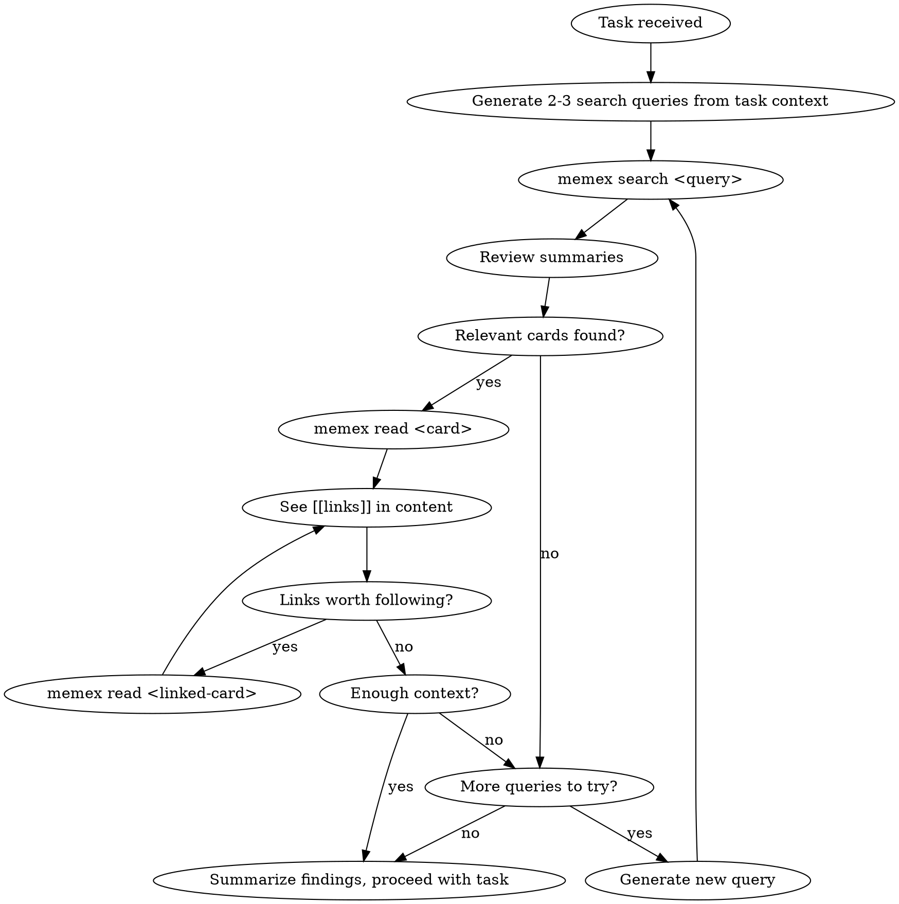
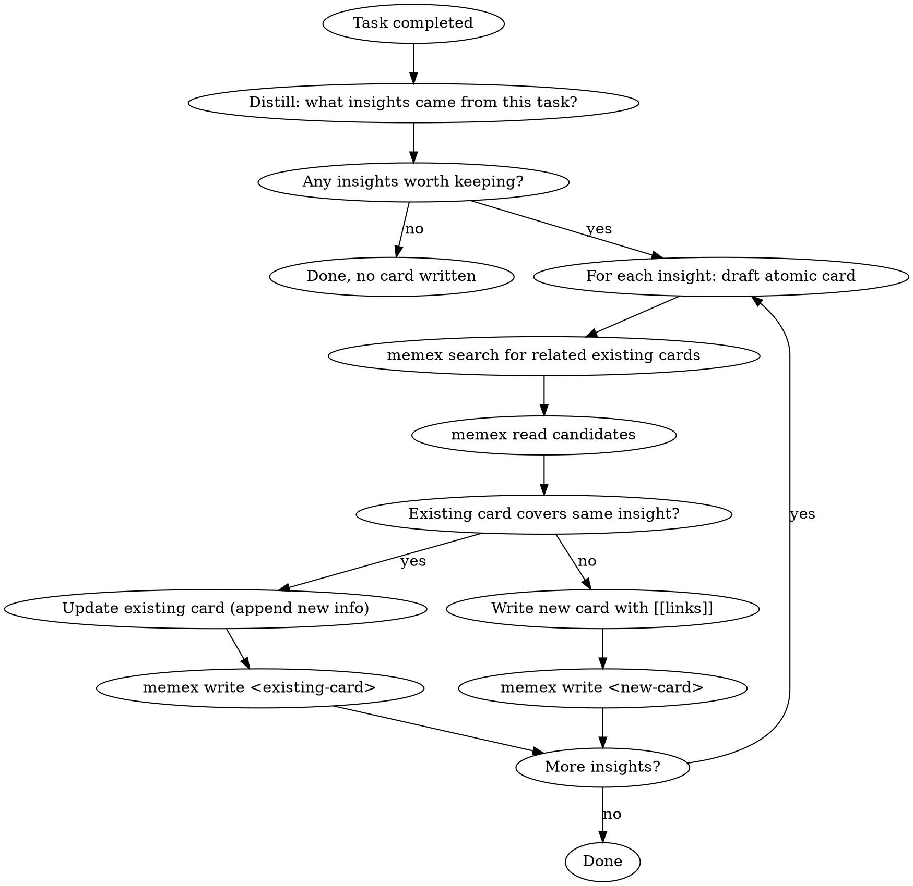
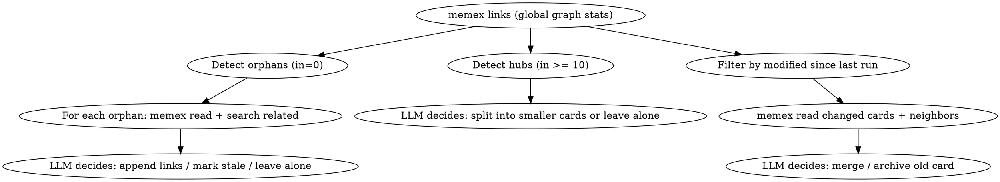

# memex-cli Design Spec

## Problem

Agent 是无状态的，每次醒来是白纸。它需要一种方式来积累和检索跨 session 的经验和知识。现有方案（mem0、Letta）依赖 vector DB，不可解释、不可调试、不可人工干预。

## Solution

基于 Luhmann Zettelkasten 方法论的 agent memory 系统。用 LLM 自身的理解能力替代 embedding 做语义匹配，用 markdown 双链替代 vector similarity 做 graph traversal。

核心 trade-off：多花一点 LLM token，换取完全的可解释性、可调试性和零基础设施依赖。

## Architecture Overview

```
┌─────────────┐  ┌─────────────┐  ┌─────────────┐
│ Claude Code  │  │ Python Agent│  │   Human     │
│              │  │             │  │ (terminal/  │
│              │  │             │  │  Obsidian)  │
└──────┬───────┘  └──────┬──────┘  └──────┬──────┘
       │                 │                │
       │  ┌──────────────┤                │
       │  │  Skills      │                │
       │  │  (recall /   │                │
       │  │   retro /    │                │
       │  │   organize)  │                │
       │  └──────┬───────┘                │
       │         │                        │
       └────┬────┴────────────────┬───────┘
            │                     │
     ┌──────▼──────┐              │
     │  memex CLI  │◄─────────────┘
     │ search/read │
     │ write/links │
     │  /archive   │
     └──────┬──────┘
            │
     ┌──────▼────────┐
     │ ~/.memex/cards/│
     │  *.md files    │
     │  (Zettelkasten)│
     └────────────────┘
```

CLI 是纯数据层，无 LLM 依赖。所有 LLM 智能在 skill 层，用 agent 自身的能力。

## Storage Layer

### Location

`~/.memex/cards/` — flat directory by default. CLI 递归扫描所有 `.md` 文件，用户可手动整理子目录，CLI 不 opinionated。

`~/.memex/archive/` — 归档目录。被 organize skill merge 或标记过时的卡片移到这里。CLI search 只扫描 `cards/`，不扫 `archive/`。人可以在 Obsidian 里看到归档卡片但 agent 不会检索到。

### Card Schema

```markdown
---
title: JWT 迁移的坑
created: 2026-03-18
modified: 2026-03-18
source: retro
---

JWT 迁移最大的坑不是实现，是 revocation。Stateless token 天然不支持即时 revoke。

这个问题的本质和 [[stateless-auth]] 里讨论的一样 — 把 state 从 server 移到 client 就意味着 server 失去了控制权。

最终我们用了 [[redis-session-store]] 里的 Redis 做 blacklist，算是在 stateless 架构上打了个补丁。
```

**Frontmatter 字段：**

| 字段 | 类型 | 说明 |
|------|------|------|
| title | string | 人类可读的完整标题 |
| created | date | 创建日期 (YYYY-MM-DD) |
| modified | date | 最后修改日期 (YYYY-MM-DD)，write 时自动更新 |
| source | string | 创建来源：`retro` / `manual` / `organize` |

**正文规则：**
- 一张卡片一个原子 insight
- `[[链接]]` 嵌在句子里，上下文自然语言说明为什么链
- 不用 tags、category、link type — 所有语义信息靠正文承载
- 文件名是 slug（英文 kebab-case）：`jwt-migration-pitfalls.md`

**Slug 规则：**
- 由调用方（LLM / 人）传入，CLI 不做自动转换
- 英文 kebab-case，如 `jwt-migration-pitfalls`
- `[[链接]]` 里的值就是 slug（不含 `.md`）
- Slug 冲突时 write 覆盖（last write wins），v1 不做锁

## CLI Layer

Node.js / TypeScript 实现。五个命令，纯数据操作，无 LLM 依赖：

### `memex search [query]`

全文搜索所有卡片（底层用 ripgrep）。Query 可选 — 无参时返回所有卡片的 slug + title 列表（供 organize skill 枚举使用）。

**有 query 时的输出格式：**
```
## jwt-migration-pitfalls
JWT 迁移的坑
JWT 迁移最大的坑不是实现，是 revocation。Stateless token 天然不支持即时 revoke。
Links: [[stateless-auth]], [[redis-session-store]]

## caching-strategy
缓存策略选型
Redis vs Memcached 的核心区别在于数据结构支持...
> 匹配行: ...revoke 失败时可以用缓存兜底...
Links: [[redis-session-store]], [[api-performance]]
```

每张匹配卡片返回：slug（作为 heading）、title、第一段摘要、匹配行（如果不在第一段则额外显示）、直接链接的 slug 列表。

**无 query 时的输出格式：**
```
jwt-migration-pitfalls  JWT 迁移的坑
caching-strategy        缓存策略选型
stateless-auth          Stateless 认证架构
```

LLM 拿到摘要后自己决定 `read` 哪些卡片。

**Error handling：**
- 无匹配：输出空，exit code 0
- 卡片目录不存在：stderr 提示，exit code 1

### `memex read <card-slug>`

读取一张卡片的完整内容（含 frontmatter）。card-slug 是文件名去掉 `.md`。支持递归查找（用户可能手动把卡片移到了子目录）。

**Error handling：**
- 卡片不存在：stderr 提示 "Card not found: <slug>"，exit code 1

### `memex write <card-slug>`

写入一张卡片。通过 stdin 传入完整 markdown（含 frontmatter）。

- 文件已存在则覆盖（last write wins）
- 自动校验 frontmatter 必须有 title、created、source
- 自动设置 `modified` 为当前日期
- 校验失败：stderr 提示缺失字段，exit code 1

### `memex links [card-slug]`

分析卡片间的链接关系。

**无参时：** 返回全局 link graph 统计 — 每张卡片的 outbound/inbound link 数量，标记 orphan（0 inbound）和 hub（inbound >= 10）。

**输出格式示例：**
```
slug                     out  in   status
jwt-migration-pitfalls   3    12   hub
caching-strategy         2    1
stateless-auth           1    0    orphan
redis-session-store      0    3
```

**有参时：** 返回指定卡片的 outbound links 和 inbound links（backlinks）列表。

```
## jwt-migration-pitfalls
Outbound: [[stateless-auth]], [[token-revocation]], [[redis-session-store]]
Inbound:  [[api-redesign-2026]], [[auth-migration-plan]], [[session-management]]
```

供 organize skill 做孤岛/hub 检测，不需要逐张 read 所有卡片。

### `memex archive <card-slug>`

将卡片从 `~/.memex/cards/` 移动到 `~/.memex/archive/`。保持文件内容不变。

- 卡片不存在：stderr 提示，exit code 1
- 已在 archive 中：stderr 提示，exit code 1

## Skill Layer

三个 skill，所有 LLM 智能在这里。Skill 通过调用 `memex` CLI 与存储层交互。

### memex-recall（任务开始时触发）



Flow 描述：
1. 从任务描述生成 2-3 个搜索关键词
2. 对每个关键词 `memex search`，拿到摘要列表
3. 看到感兴趣的卡片 → `memex read` 拿完整内容
4. 读到正文里的 `[[链接]]` → 判断要不要 follow → 要就继续 `memex read`
5. 觉得上下文够了 → 停，总结 findings，开始执行任务
6. 觉得不够但当前路径走完了 → 换个关键词再 search

**Guardrails（硬限制）：**
- `max_hops: 3` — link follow 最多 3 跳
- `max_cards_read: 20` — 单次 recall 最多读 20 张卡片
- 超过限制时强制停止，用已有信息继续任务

退出条件：LLM 自己判断"够了"、所有 query 都试完、或触及 guardrail。

### memex-retro（任务完成后触发）



Flow 描述：
1. 判断任务有没有值得记录的 insight（不是每次都写）
2. 每个 insight 一张原子卡片
3. 写之前先 search 已有卡片，找到该链谁
4. **去重判断**：如果已有卡片覆盖了相同 insight，更新已有卡片（追加新信息）而不是新建
5. 新卡片的链接写在正文里，自然语言说明关联

### memex-organize（定期触发，cron skill）

用 agent 自身的 LLM 能力，调 CLI 的 search/read/write 完成卡片网络维护。



三个检测：
1. **孤岛检测** — 没有任何 inbound link 的卡片 → 补链接（追加到正文末尾，不修改已有内容）或标记 stale
2. **Hub 检测** — 被过多卡片链接 → 考虑拆分成更原子的概念
3. **矛盾/过时检测** — 内容矛盾或过时 → merge 或 archive

**操作规则：**
- 补链接：只追加到正文末尾，不修改已有内容
- Merge：将源卡片内容追加到目标卡片，源卡片移到 `~/.memex/archive/`
- Archive：将过时卡片移到 `~/.memex/archive/`
- Organize 通过 `memex links`（无参）获取全局 link graph 统计，识别 orphan 和 hub
- 增量策略：organize 将上次运行时间写入 `~/.memex/.last-organize`，下次只处理 `modified` 晚于该时间的卡片及其 neighbors
- 通过 `memex archive` 移动过时卡片，不直接操作文件系统

## Integration

| Agent 环境 | 接入方式 |
|------------|---------|
| Claude Code | skill 调 `memex` CLI |
| Python agent | subprocess 调 CLI |
| 其他 LLM agent | subprocess 调 CLI |
| 人类 | 终端直接用 CLI / Obsidian 打开 `~/.memex/cards/` |
| 未来 | MCP server 封装（v2 scope） |

## Tech Stack

| 组件 | 选型 |
|------|------|
| Runtime | Node.js / TypeScript |
| CLI 框架 | commander |
| Frontmatter | gray-matter |
| 搜索 | ripgrep (@vscode/ripgrep) |
| 分发 | npm (npx memex-cli / npm install -g) |

## Project Structure

```
memex-cli/
  src/
    cli.ts              # 入口，解析命令
    commands/
      search.ts         # 全文搜索，返回摘要
      read.ts           # 读卡片完整内容
      write.ts          # 写卡片，校验 frontmatter
      links.ts          # link graph 分析
      archive.ts        # 移动卡片到归档
    lib/
      parser.ts         # 解析 frontmatter + 提取 [[links]]
      store.ts          # 文件系统操作（递归扫描、读写）
  skills/
    memex-recall/       # recall skill
    memex-retro/        # retro skill
    memex-organize/     # organize skill
  package.json
  tsconfig.json
```

## Design Principles

1. **Zettelkasten 原样照搬** — 原子卡片、自然语言链接、上下文即语义、不做分类
2. **LLM 是 semantic search engine** — 不需要 embedding / vector DB
3. **双链是 graph traversal engine** — 显式关系替代 vector similarity
4. **CLI 是纯数据层** — 五个命令（search/read/write/links/archive），无 LLM 依赖，任何环境都能调
5. **Skill 是智能层** — 所有 LLM 逻辑在 skill，用 agent 自身能力
6. **人可干预** — Obsidian 打开就能看、改、补
7. **零基础设施** — 纯文件系统，不需要数据库，不需要 API key
